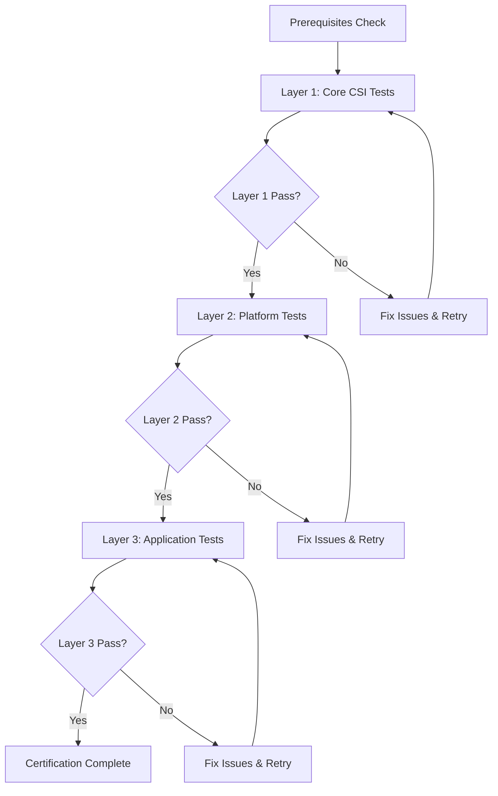

# CSI Replication Certification - Test Plan Matrix

## Overview
This document provides a comprehensive test plan matrix for CSI Replication certification. It covers all three testing layers and provides a clear roadmap for certification execution.

---

## Test Execution Order



---

## Test Matrix Legend

| Symbol | Meaning |
|--------|---------|
| 🔴 | Mandatory - Must pass for certification |
| 🟡 | Recommended - Should pass for complete certification |
| 🟢 | Optional - Nice to have but not required |
| ⏱️ | Time estimate |
| 🔗 | Has dependencies on other tests |

---

## Layer 1: Kubernetes Core CSI Tests

### L1.1 - Basic Provisioning Tests

| Test ID | Test Name | Description | Priority | Time | Dependencies |
|---------|-----------|-------------|----------|------|--------------|
| L1.1.1 | Dynamic Provisioning | Create PVC, verify PV auto-created | 🔴 | ⏱️ 2min | None |
| L1.1.2 | Volume Binding | Verify PVC binds to PV correctly | 🔴 | ⏱️ 1min | L1.1.1 |
| L1.1.3 | Volume Deletion | Delete PVC, verify PV removed (Delete policy) | 🔴 | ⏱️ 2min | L1.1.1 |
| L1.1.4 | Volume Retention | Delete PVC, verify PV retained (Retain policy) | 🟡 | ⏱️ 2min | L1.1.1 |
| L1.1.5 | Pre-bound PVC | Create PV first, then bind specific PVC | 🟢 | ⏱️ 2min | None |
| L1.1.6 | Storage Class Params | Provision with custom SC parameters | 🟡 | ⏱️ 3min | L1.1.1 |
| L1.1.7 | Multiple Size Classes | Provision volumes of various sizes | 🟡 | ⏱️ 5min | L1.1.1 |
| L1.1.8 | Volume Modes | Test both Filesystem and Block modes | 🟡 | ⏱️ 4min | L1.1.1 |

**Expected Outcomes:**
- ✅ All mandatory tests pass
- ✅ PVC → Bound within 30 seconds
- ✅ Volumes accessible in pods
- ✅ No orphaned resources after deletion

---

### L1.2 - Volume Attachment Tests

| Test ID | Test Name | Description | Priority | Time | Dependencies |
|---------|-----------|-------------|----------|------|--------------|
| L1.2.1 | Single Attach | Attach volume to one node | 🔴 | ⏱️ 2min | L1.1.1 |
| L1.2.2 | Detach | Detach volume from node | 🔴 | ⏱️ 2min | L1.2.1 |
| L1.2.3 | Re-attach | Attach previously detached volume | 🔴 | ⏱️ 2min | L1.2.2 |
| L1.2.4 | Multi-attach (if supported) | Attach same volume to multiple nodes | 🟢 | ⏱️ 3min | L1.2.1 |
| L1.2.5 | Attach Limits | Respect CSINode attach limits | 🟡 | ⏱️ 5min | L1.2.1 |
| L1.2.6 | Node Failure Handling | Detach when node unreachable | 🟡 | ⏱️ 10min | L1.2.1 |

**Expected Outcomes:**
- ✅ Volumes attach successfully within 60 seconds
- ✅ Detach completes cleanly
- ✅ Volume can be reattached to different node
- ✅ Attach limits properly enforced

---

### L1.3 - Volume Snapshot Tests

| Test ID | Test Name | Description | Priority | Time | Dependencies |
|---------|-----------|-------------|----------|------|--------------|
| L1.3.1 | Create Snapshot | Create VolumeSnapshot from PVC | 🟡 | ⏱️ 3min | L1.1.1 |
| L1.3.2 | Snapshot Ready State | Verify ReadyToUse=true | 🟡 | ⏱️ 2min | L1.3.1 |
| L1.3.3 | Restore from Snapshot | Create PVC from VolumeSnapshot | 🟡 | ⏱️ 5min | L1.3.1 |
| L1.3.4 | Data Consistency | Verify restored data matches snapshot | 🟡 | ⏱️ 3min | L1.3.3 |
| L1.3.5 | Delete Snapshot | Remove VolumeSnapshot | 🟡 | ⏱️ 2min | L1.3.1 |
| L1.3.6 | Snapshot with Data | Snapshot PVC containing test data | 🟡 | ⏱️ 5min | L1.3.1 |
| L1.3.7 | Multiple Snapshots | Create multiple snapshots of same PVC | 🟢 | ⏱️ 5min | L1.3.1 |

**Expected Outcomes:**
- ✅ Snapshots create successfully
- ✅ Snapshots reach ReadyToUse within 120 seconds
- ✅ Restored data is consistent
- ✅ Snapshots are independent of source volume

---

### L1.4 - Volume Expansion Tests

| Test ID | Test Name | Description | Priority | Time | Dependencies |
|---------|-----------|-------------|----------|------|--------------|
| L1.4.1 | Online Expansion | Expand volume while pod running | 🟡 | ⏱️ 5min | L1.1.1 |
| L1.4.2 | Filesystem Resize | Verify filesystem reflects new size | 🟡 | ⏱️ 3min | L1.4.1 |
| L1.4.3 | Data Preservation | Verify data intact after expansion | 🟡 | ⏱️ 2min | L1.4.1 |
| L1.4.4 | Offline Expansion | Expand volume without active pods | 🟢 | ⏱️ 5min | L1.1.1 |
| L1.4.5 | Block Volume Expansion | Expand raw block volumes | 🟢 | ⏱️ 5min | L1.1.1 |

**Expected Outcomes:**
- ✅ PVC size updated successfully
- ✅ Filesystem expanded (for file volumes)
- ✅ No data loss during expansion
- ✅ Application can use new capacity

---

## Layer 2: OCP Platform Tests

### L2.1 - LUN Stress Test (CRITICAL)

| Test ID | Test Name | Description | Priority | Time | Dependencies |
|---------|-----------|-------------|----------|------|--------------|
| L2.1.1 | 260 Pod Stress | Create 260 pods with PVCs on single node | 🔴 | ⏱️ 40min | L1.1.1 |
| L2.1.2 | Attach Limit Validation | Verify CSINode limits respected | 🔴 | ⏱️ 5min | L2.1.1 |
| L2.1.3 | Error Handling | Verify proper errors when over limit | 🔴 | ⏱️ 5min | L2.1.1 |
| L2.1.4 | Recovery | Verify driver recovers after stress | 🔴 | ⏱️ 10min | L2.1.1 |
| L2.1.5 | LUN >256 Handling | Test with LUN IDs above 256 | 🟡 | ⏱️ 10min | L2.1.1 |

**Expected Outcomes:**
- ✅ All 260 pods eventually succeed
- ✅ Completes within 40 minutes
- ✅ No panics or crashes in driver
- ✅ Proper backoff and retry behavior
- ✅ All volumes properly cleaned up

**Configuration:**
```yaml
Driver: your-driver.example.com
LUNStressTest:
  PodsTotal: 260
  Timeout: "40m"
```

---

### L2.2 - VolumeReplication Tests

| Test ID | Test Name | Description | Priority | Time | Dependencies |
|---------|-----------|-------------|----------|------|--------------|
| L2.2.1 | Enable Replication | Create VolumeReplication CR | 🔴 | ⏱️ 5min | L1.1.1 |
| L2.2.2 | Primary State | Set replicationState=primary | 🔴 | ⏱️ 3min | L2.2.1 |
| L2.2.3 | Secondary State | Set replicationState=secondary | 🔴 | ⏱️ 3min | L2.2.1 |
| L2.2.4 | Promote Operation | Promote secondary to primary | 🔴 | ⏱️ 5min | L2.2.3 |
| L2.2.5 | Demote Operation | Demote primary to secondary | 🔴 | ⏱️ 5min | L2.2.2 |
| L2.2.6 | Replication Status | Verify status updates correctly | 🔴 | ⏱️ 3min | L2.2.1 |
| L2.2.7 | Resync Operation | Trigger and complete resync | 🟡 | ⏱️ 10min | L2.2.1 |
| L2.2.8 | Replication Lag | Monitor and report replication lag | 🟢 | ⏱️ 5min | L2.2.1 |

**Expected Outcomes:**
- ✅ VolumeReplication CR transitions states correctly
- ✅ Status accurately reflects backend state
- ✅ Promote/demote complete without data loss
- ✅ Replication operates continuously

---

### L2.3 - VolumeReplicationGroup Tests

| Test ID | Test Name | Description | Priority | Time | Dependencies |
|---------|-----------|-------------|----------|------|--------------|
| L2.3.1 | VRG Creation | Create VRG with PVC selector | 🔴 | ⏱️ 5min | L1.1.1, L2.2.1 |
| L2.3.2 | PVC Discovery | Verify VRG finds matching PVCs | 🔴 | ⏱️ 3min | L2.3.1 |
| L2.3.3 | Group Replication | Multiple PVCs replicated together | 🔴 | ⏱️ 10min | L2.3.1 |
| L2.3.4 | Coordinated Failover | All PVCs fail over together | 🔴 | ⏱️ 10min | L2.3.3 |
| L2.3.5 | State Consistency | All volumes in same state | 🔴 | ⏱️ 5min | L2.3.3 |
| L2.3.6 | Add PVC to Group | New PVC added dynamically | 🟡 | ⏱️ 5min | L2.3.1 |
| L2.3.7 | Remove PVC from Group | PVC removed from replication | 🟡 | ⏱️ 5min | L2.3.1 |

**Expected Outcomes:**
- ✅ VRG correctly identifies all matching PVCs
- ✅ Group operations are atomic
- ✅ All volumes maintain consistency
- ✅ Status reflects all member states

---

### L2.4 - Multi-Cluster Failover Tests

| Test ID | Test Name | Description | Priority | Time | Dependencies |
|---------|-----------|-------------|----------|------|--------------|
| L2.4.1 | Cross-Cluster Setup | Configure replication between clusters | 🔴 | ⏱️ 15min | L2.3.1 |
| L2.4.2 | Primary Cluster Workload | Deploy app on primary cluster | 🔴 | ⏱️ 5min | L2.4.1 |
| L2.4.3 | Planned Failover | Gracefully fail over to secondary | 🔴 | ⏱️ 10min | L2.4.2 |
| L2.4.4 | Data Validation | Verify data on secondary cluster | 🔴 | ⏱️ 5min | L2.4.3 |
| L2.4.5 | Unplanned Failover | Simulate primary cluster failure | 🔴 | ⏱️ 15min | L2.4.2 |
| L2.4.6 | Failback | Return to primary cluster | 🟡 | ⏱️ 15min | L2.4.3 |
| L2.4.7 | Fencing | Prevent split-brain scenarios | 🔴 | ⏱️ 10min | L2.4.5 |

**Expected Outcomes:**
- ✅ Planned failover completes with zero data loss
- ✅ Unplanned failover recovers correctly
- ✅ Application accessible after failover
- ✅ Fencing prevents dual-primary scenarios

---

## Layer 3: CNV Application Tests

### L3.1 - VM Boot Tests

| Test ID | Test Name | Description | Priority | Time | Dependencies |
|---------|-----------|-------------|----------|------|--------------|
| L3.1.1 | VM from Replicated PVC | Boot VM using replicated volume | 🔴 | ⏱️ 5min | L2.2.1 |
| L3.1.2 | VM Data Access | Verify VM can read/write data | 🔴 | ⏱️ 3min | L3.1.1 |
| L3.1.3 | VM Reboot | Reboot VM, verify persistence | 🔴 | ⏱️ 5min | L3.1.1 |
| L3.1.4 | Multiple VMs | Boot multiple VMs with replicated storage | 🟡 | ⏱️ 10min | L3.1.1 |
| L3.1.5 | VM on Secondary | Boot VM on secondary cluster | 🔴 | ⏱️ 5min | L2.4.1, L3.1.1 |

**Expected Outcomes:**
- ✅ VMs boot successfully within 2 minutes
- ✅ Storage accessible within VM
- ✅ Data persists across VM lifecycle
- ✅ VMs functional on both clusters

---

### L3.2 - VM Live Migration Tests

| Test ID | Test Name | Description | Priority | Time | Dependencies |
|---------|-----------|-------------|----------|------|--------------|
| L3.2.1 | Live Migration | Migrate running VM to different node | 🟡 | ⏱️ 10min | L3.1.1 |
| L3.2.2 | Migration with Replication | Migrate while replication active | 🟡 | ⏱️ 15min | L3.2.1, L2.2.1 |
| L3.2.3 | Data Integrity Post-Migration | Verify data after migration | 🟡 | ⏱️ 5min | L3.2.1 |
| L3.2.4 | Application Continuity | Verify app remains available during migration | 🟢 | ⏱️ 10min | L3.2.1 |

**Expected Outcomes:**
- ✅ Migration completes successfully
- ✅ Replication continues during migration
- ✅ No data loss or corruption
- ✅ Minimal downtime (<5 seconds)

---

### L3.3 - VM Snapshot and Consistency Tests

| Test ID | Test Name | Description | Priority | Time | Dependencies |
|---------|-----------|-------------|----------|------|--------------|
| L3.3.1 | VM Snapshot | Create snapshot of running VM | 🟡 | ⏱️ 5min | L3.1.1, L1.3.1 |
| L3.3.2 | Quiesced Snapshot | Snapshot with filesystem quiesce | 🟡 | ⏱️ 7min | L3.3.1 |
| L3.3.3 | VM Restore | Restore VM from snapshot | 🟡 | ⏱️ 10min | L3.3.1 |
| L3.3.4 | Database Consistency | Snapshot running database VM | 🟢 | ⏱️ 15min | L3.3.2 |
| L3.3.5 | Application Hooks | Execute pre/post snapshot hooks | 🟢 | ⏱️ 10min | L3.3.2 |

**Expected Outcomes:**
- ✅ Snapshots capture consistent state
- ✅ Restored VMs boot successfully
- ✅ Application data is consistent
- ✅ Hooks execute in correct order

---

### L3.4 - VM Failover Tests

| Test ID | Test Name | Description | Priority | Time | Dependencies |
|---------|-----------|-------------|----------|------|--------------|
| L3.4.1 | VM Failover | Fail over VM to secondary cluster | 🔴 | ⏱️ 15min | L3.1.1, L2.4.3 |
| L3.4.2 | VM Boot on Secondary | Start VM after failover | 🔴 | ⏱️ 5min | L3.4.1 |
| L3.4.3 | Data Validation | Verify VM data after failover | 🔴 | ⏱️ 5min | L3.4.2 |
| L3.4.4 | Application Recovery | Verify app functionality post-failover | 🔴 | ⏱️ 10min | L3.4.2 |
| L3.4.5 | RTO Measurement | Measure Recovery Time Objective | 🟡 | ⏱️ 5min | L3.4.1 |
| L3.4.6 | RPO Validation | Validate Recovery Point Objective | 🟡 | ⏱️ 5min | L3.4.3 |

**Expected Outcomes:**
- ✅ VM successfully fails over to secondary
- ✅ VM boots and functions correctly
- ✅ Data loss within acceptable RPO
- ✅ Recovery time within acceptable RTO

---

## Test Execution Summary

### Time Estimates by Layer

| Layer | Mandatory Tests | Optional Tests | Total Time | Pass Rate Required |
|-------|----------------|----------------|------------|-------------------|
| Layer 1 | 12 tests, ~25 min | 15 tests, ~35 min | ~60 min | 100% mandatory |
| Layer 2 | 18 tests, ~90 min | 8 tests, ~45 min | ~135 min | 100% mandatory |
| Layer 3 | 11 tests, ~65 min | 9 tests, ~60 min | ~125 min | 100% mandatory |
| **Total** | **41 tests, ~180 min** | **32 tests, ~140 min** | **~320 min** | **100% mandatory** |

---

## Certification Criteria

### Minimum Requirements (Full Certification)
- ✅ 100% of mandatory Layer 1 tests pass
- ✅ 100% of mandatory Layer 2 tests pass (including LUN stress test)
- ✅ 100% of mandatory Layer 3 tests pass
- ✅ LUN stress test completes in <40 minutes
- ✅ Failover RTO < 5 minutes
- ✅ RPO ≤ last replication interval

### Recommended for Complete Certification
- ✅ 80%+ of optional Layer 1 tests pass
- ✅ 80%+ of optional Layer 2 tests pass
- ✅ 80%+ of optional Layer 3 tests pass
- ✅ Volume expansion supported
- ✅ Snapshots supported

### Basic Certification (Minimum Viable)
- ✅ 100% of mandatory Layer 1 tests pass
- ✅ 100% of mandatory Layer 2 VolumeReplication tests pass
- ✅ Basic failover tests pass (L2.4.1-L2.4.5)
- ⚠️ Layer 3 not required for basic certification

---

## Next Steps

After reviewing this test plan:
1. [Layer 1 README](./layer-1-readme.md) - Execute Kubernetes core tests
2. [Layer 2 README](./layer-2-readme.md) - Execute platform tests
3. [Layer 3 README](./layer-3-readme.md) - Execute application tests
4. [Suggested Tests](./suggested-tests.md) - Additional test scenarios